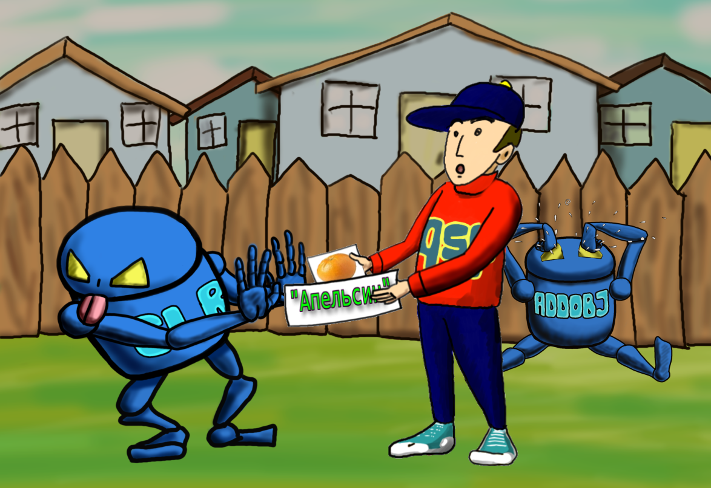
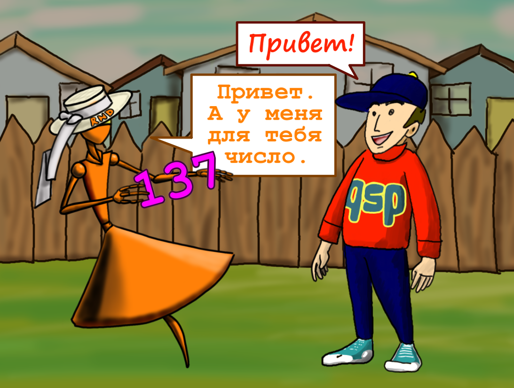
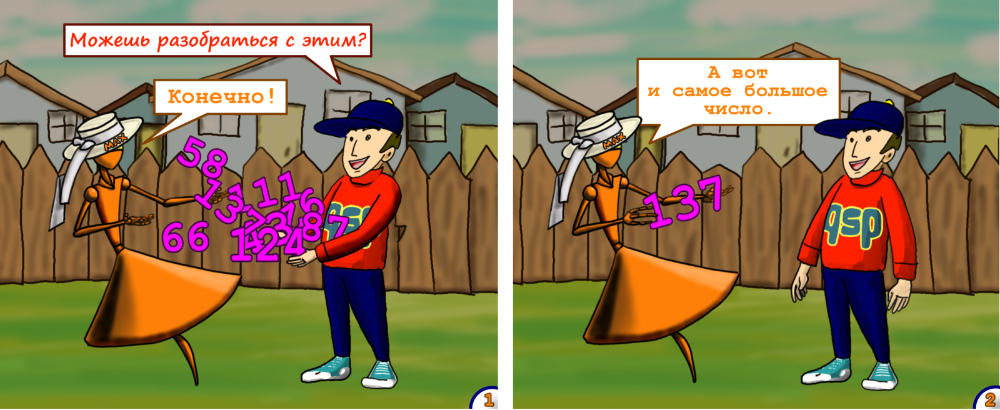

# Операторы, функции, аргументы. GOSUB, FUNC, ARGS
<!-- [:gosub_func_args] -->

Очень часто новички, пришедшие в QSP, задают вопрос: что такое ARGS, и как их использовать? И хотя информации по данному вопросу очень много, вся она довольно разрознена, отвечает на вопрос слишком общо, или слишком конкретно, вплоть до одного единственного примера.

Эта статья является попыткой ответить на данный вопрос максимально просто, точно и подробно, насколько это в принципе будет возможно.


Все примеры рекомендую испытать самостоятельно, побаловаться, изменяя значения, и посмотреть, что из этого выйдет. Теория без практики — мертва.

:::warning[Обратите внимание.]
 В статье приведены фрагменты кода QSP, некоторые из которых написаны в формате TXT2GAM. Такие фрагменты легко отличить, так как в них отдельными строками прописывается начало локации (`# start`) и её конец (`--- start ---`). Если вы работаете в редакторе Quest Generator, данные строчки прописывать в коде локаций не нужно, только содержимое между ними.
 :::

## Пробуем воду. Немного определений

### Операторы

При написании QSP-кода мы всегда используем различные операторы. Например, мы используем оператор `*pl` для вывода текста в окно основного описания, или оператор `addobj` для добавления предмета, или например оператор `goto` для перехода между локациями. Иными словами операторы нужны нам, чтобы что-то `делать` с игрой или с плеером, выполнять какие-то процедуры.

Если мы внимательно посмотрим на все эти операторы, то мы увидим, что для некоторых операторов, чтобы они что-то сделали, нужно обязательно указать какое-то значение. Например, чтобы оператор `addobj` добавил предмет в окно предметов, мы должны указать название предмета для этого оператора:

```qsp
addobj "Апельсин"
```


Такое указание значения в программировании называется `передачей значения` оператору. Оператор принимает от нас указанное значение и что-то с ним делает. Например, создаёт предмет с указанным названием. Само значение, которое мы передаём оператору, нередко называют `аргументом` или `параметром`.

Поэтому если вы встречаете где-то такое выражение "передаю параметры оператору", или "указываю аргументы для оператора", это значит, что оператору передаются какие-то значения, которые он принимает и обрабатывает.

В случае с оператором `addobj` мы должны обязательно указать хотя бы один аргумент, но в QSP есть операторы, для которых можно совсем не указывать аргументы. Например, оператору `clear`, который очищает окно дополнительного описания, не нужны аргументы, он и так знает, что ему делать. Или оператор `killall`, ему тоже не нужен аргумент. Ещё, совсем без аргумента, может использоваться оператор `*pl`, тогда он просто выводит на экран пустую строку и совершает переход на новую строку в окне основного описания.

Некоторым операторам можно передавать больше одного аргумента. Если взглянуть на тот же оператор `addobj`, мы можем передавать ему и два и три аргумента:

```qsp
addobj "Апельсин","pic/orange.png",4
```

В данном случае мы передаём оператору три аргумента: название предмета, картинку предмета, и позицию в окне предметов, в которую мы данный предмет хотим поместить. Аргументы перечисляются через запятую.

В зависимости от числа принимаемых аргументов, операторы могут вести себя по-разному:

```qsp
killvar '$mass',4	& ! два аргумента. Удаляем ячейку номер 4 из массива $mass
killvar '$array'	& ! один аргумент. Удаляем весь массив $array
killvar				& ! без аргументов. Удаляет все массивы и переменные в игре
```

Нужно помнить, сколько аргументов ожидает получить каждый оператор. Операторы типа `clear` и `killall` вообще не ждут аргументов, поэтому передавать им какие-либо значения бесполезно. Оперторы типа `addobj`, `goto` и `act` ждут хотя бы один аргумент, но могут принимать больше. Если передать оператору больше аргументов, чем он может принять, или меньше, чем он ожидает, это приведёт к ошибке №120: "Неверное число аргументов оператора/функции", — поэтому будьте внимательны при написании кода и чаще сверяйтесь со справкой.



### Функции

Помимо операторов в QSP есть ещё такие вещи, как `функции`. Функции тоже могут что-нибудь делать с игрой или плеером, но в основном они нужны, чтобы получать какие-либо значения.

Например, с помощью функции `rnd` мы можем получить случайное число от 1 до 1000:

```qsp
num=rnd	& ! в переменную num запишется случайное число от 1 до 1000
```

В этом и заключается основное отличие функции от оператора, функция умеет `возвращать значение`. Значение, возвращаемое функцией, ещё называют `результатом`, поэтому можно сказать, что `функция возвращает результат`.



Точно так же, как оператор, функция может принимать аргументы, однако аргументы, которые мы хотим передать функции, нужно заключать в круглые скобки, в отличие от операторов, которым такие скобки не нужны.

```qsp
num=rand(1,1000)	& ! аргументы функции rand заключены в скобки
killvar '$mass',9	& ! аргументы оператора killvar не нужно заключать в скобки
```

Таким образом функция `принимает аргументы` и `возвращает результат`. Или `получает параметры` и `возвращает значение`. Говорите, как вам удобнее, главное, чтобы вы понимали, что все эти слова значат.

В QSP есть много разных функций, и так же, как и операторам, им можно передавать разное число аргументов. Есть функции, которым вообще не нужно передавать никаких аргументов, например `$selact`, `$curact`, `$curloc` и т.д. А есть функции, которые требуют строго определённого числа аргументов, например `isnum`, которая ожидает всегда только один аргумент, не больше, не меньше. Ну и конечно же есть функции, которым можно передавать разное число аргументов, и чьё поведение будет меняться в зависимости от числа аргументов:

```qsp
max('mass')	& ! передан один строковый аргумент. Функция вернёт максимальное число из массива mass
max('mass','gass','dass')	& ! передано три строковых аргумента. Функция вернёт тот из них, который идёт позже в алфавитном порядке
max(12)	& ! данная строчка кода вызовет ошибку 114
max(12,34)	& ! функция вернёт наибольшее из двух чисел (34)
```



## Плаваем у берега. Пользовательские функции и процедуры

Как быть, когда нам не хватает функционала уже имеющихся в QSP функций и операторов? Что если нам нужно, например, постоянно выводить на экран значения некоторых переменных, причём не просто выводить, а выводить эти значения внутри определённой строки. Например, у нас есть вот такой набор переменных:

```qsp
$name='Леголас'
age=137
$arms='Лук и стрелы'
```

И мы хотим периодически видеть на экране что-то вроде:

```
Вас зовут Леголас.
Вам 137 лет.
Вы используете Лук и стрелы.
```

Для этой ситуации в QSP предусмотрено создание собственных аналогов функций и операторов. Для этого мы должны создать отдельную локацию и написать на ней нужный код. В нашем случае локация будет называться "pl_stat":

```qsp
! # pl_stat
*pl "Вас зовут <<$name>>."
*pl "Вам <<age>> лет."
*pl "Вы используете <<$arms>>."
```

И теперь, когда у нас есть такая локация, нам достаточно вызвать её с помощью оператора `gosub` в любом месте нашей игры, и мы увидим на экране нужный текст со вставленной информацией из наших переменных.

```qsp
gosub 'pl_stat'
```

Очевидно, что работа данной локации стала похожа на работу некоей расширенной версии оператора `*pl`.

Что же дальше? А дальше нам хотелось бы написать какой-нибудь аналог функции, например, чтобы посчитать квадрат числа N. И мы можем это сделать. Создадим локацию "square" и на ней напишем следующий код:

```qsp
! # square
R=N*N
```

Вот такой простой код. Если мы вызовем данную локацию с помощью `func`, то в переменную R у нас запишется результат возведения в квадрат числа N.

```qsp
N=12
func('square')
*pl R	& ! на экране появится число 144
```

Однако с таким же успехом мы можем вызывать данную локацию через `gosub`, ведь результат вычислений всё равно пишется в переменную R прямо на локации "square". Зачем нам здесь использовать `func`? Действительно незачем. Сейчас наша локация просто вычисляет значение и записывает его в переменную, однако мы можем заставить её `возвращать значение`! То есть она будет работать почти как полноценная функция QSP.

Чтобы заставить нашу локацию возвращать значение, мы должны результат вычислений записать в специальную системную переменную `result`.

```qsp
! # square
result=N*N
```

Теперь наша локация будет возвращать нам значение аналогично любой встроенной в QSP функции. А значит мы можем присвоить значение переменной уже в той локации, из которой вызвали локацию "square":

```qsp
N=12
R=func('square')
*pl R	& ! на экране появится число 144
```

Или вообще не использовать промежуточную переменную:

```qsp
N=12
*pl func('square')	& ! на экране появится число 144
```

Уникальность переменной `result` заключается в том, что она действительно уникальная на каждой локации, из которой мы её вызываем. То есть, если мы на локации "start" (для примера) записали в переменную `result` какое-либо значение, то, если мы вызовем из локации "start" локацию "square", где мы тоже используем `result`, на локации "start" значение в переменной `result` не изменится. Это легко проверить:

```qsp
# start
result=123	& ! записываем число в переменную result
N=24
*pl func('square')	& ! выведет на экран 576
*pl result	& ! выведет на экран 123
- start -

# square
result = N * N 
- square -
```

И всё-таки наш код не такой удобный, как бы нам хотелось, ведь функциям QSP мы просто передаём аргументы, и не заполняем заранее разные переменные перед тем, как вызвать ту или иную функцию. Что же делать?

А всё очень просто. Разработчик QSP предусмотрел такую необходимость, и мы можем передавать нашей локации до девяти аргументов (в плеере версии 5.7.0). Просто берём и внутри круглых скобок ставим запятую после названия нашей локации "square" и указываем значение, которое хотим передать локации:

```qsp
*pl func('square',25)
```

Вот и всё. На локацию "square" передан `параметр`, или иными словами локация "square" `получила в качестве аргумента` значение `25`. Но как же это значение использовать на локации "square", ведь теперь мы не вносили его ни в одну переменную. А вся хитрость в том, что данное значение плеер сам автоматически вносит в специальный системный массив `args`. В данном случае число `25` нужно искать в нулевой ячейке этого массива на локации "square".

```qsp
! # square
*pl args[0]	& ! выведет на экран число, которое мы отправляем на эту локацию
result=args[0]*args[0]	& ! вместо N мы теперь используем число из нулевой ячейки массива args
```

Попробуйте запустить код из предыдущего примера, но теперь без переменной N:

```qsp
# start
result=123	& ! записываем число в переменную result
*pl func('square',24)	& ! выведет на экран 576
*pl result	& ! выведет на экран 123
- start -

# square
*pl args[0] 	& ! поскольку выше мы передаём на square число 24, то эта команда выведет на экран число 24
result=args[0]*args[0]
- square -
```

Итак, мы знаем, что можем передавать на нашу локацию-функцию до девяти аргументов. Мы нашли, где искать аргумент, если он один. А где же искать все остальные? Всё очень просто. Каждый последующий аргумент будет автоматически помещаться в следующую ячейку массива args. Таким образом, если мы передадим на локацию все девять аргументов, мы сможем их найти в массиве args, в ячейках с нулевой по восьмую.

Давайте напишем функцию, которая будет складывать девять чисел, передаваемых ей в качестве аргументов. Для этого создаём локацию "summ":

```qsp
! # summ
result=args[0]+args[1]+args[2]+args[3]+args[4]+args[5]+args[6]+args[7]+args[8]
```

А вот примеры вызова этой локации "summ". Мы передаём на эту локацию девять слагаемых, а она возвращает нам сумму всех девяти слагаемых:

```qsp
*pl func('summ',1,2,3,4,5,6,7,8,9)	& ! на экране появится число 45
*pl func('summ',23,45,67,89,0,11,23,5,-1)	& ! на экране появится число 262
```

Если мы укажем не все аргументы, значения несуществующих ячеек массива `args` на локации "summ" окажутся равны нулю:

```qsp
*pl func('summ',1,2,3,4)	& ! на экране появится число 10
*pl func('summ',23,45,67)	& ! на экране появится число 135
```

С массивом `args` можно работать, как с обычным массивом QSP. Т.е. вы легко можете добавлять в него новые ячейки, или удалять с помощью `killvar`. Однако у этого массива есть одна особенность, которая роднит его с переменной `result`. Для каждой отдельной локации массив `args` уникален. То есть вы можете помещать в него любые значения, увеличивать или уменьшать его размер, это никак не повлияет на массив `args` в других локациях.

Более того. После того, как код локации, на которой вы работали с массивом `args`, будет выполнен, этот уникальный массив будет полностью уничтожен, а значит он уже не будет занимать место в оперативной памяти. Но, надо понимать, что в других работающих локациях свои собственные массивы `args` продолжат существовать.

```qsp
! данный код выведет на экран последовательно числа 11, 1507, 19
# start
args[0]=19	& ! это нулевая ячейка массива args на локации start, ей присваиваем 19
*pl func('foo',11)	& ! выведет на экран 1507
*pl args[0]	& ! выведет на экран 19
- start -

# foo
! на локации foo собственный уникальный массив args,
! в который автоматически записываются значения, переданные на локацию в виде аргументов
*pl args[0]	& ! выше сюда было передано число 11, вот его мы и увидим на экране
result = args[0] * 137
- foo -
```

Давайте вернёмся к локации "pl_stat", она, как вы помните, выводила на экран значения определённых переменных. Теперь мы можем переписать и её, чтобы она работала не с конкретными переменными, а с аргументами, которые мы на эту локацию передаём.

```qsp
! # pl_stat
*pl "Вас зовут <<$args[0]>>."
*pl "Вам <<args[1]>> лет."
*pl "Вы используете <<$args[2]>>."
```

Как видите, мы подставляем в строки данные из `$args[0]`, `args[1]` и `$args[2]`, где соответсвенно мы должны найти имя, возраст и оружие персонажа. Значит и передавать на "pl_stat" аргументы мы должны в той же последовательности:

```qsp
$name='Леголас'
age=137
$arms='Лук и стрелы'
! вызов локации `pl_stat`
gosub "pl_stat",$name,age,$arms
```

Это даст на экране всё тот же текст:

```
Вас зовут Леголас.
Вам 137 лет.
Вы используете Лук и стрелы.
```

Само собой, если нет необходимости, заранее объявлять переменные не обязательно:

```qsp
gosub "pl_stat",'Леголас',137,'Лук и стрелы'
```

И теперь, один раз написанная локация позволяет нам выводить текст с нужными вставками сколько угодно раз:

```qsp
gosub 'pl_stat','Гимли',91,'Молот'
gosub 'pl_stat','Арагорн',29,'Палаш'
gosub 'pl_stat','Фродо Бэггинс',19,'Кольцо Всевластия'
```

Вот результат таких вызовов:

```
Вас зовут Гимли.
Вам 91 лет.
Вы используете Молот.
Вас зовут Арагорн.
Вам 29 лет.
Вы используете палаш.
Вас зовут Фродо Бэггинс.
Вам 19 лет.
Вы используете Кольцо Всевластия.
```

**Объявить переменную** — для QSP значит записать в программе её имя. Когда мы присваиваем переменной какое-либо значение, мы тем самым автоматически объявляем переменную. Ещё это называется *инициализировать* переменную.

## Глубокое погружение. Тонкости и нюансы при написании собственных функций и процедур

Когда мы писали локации типа "square" и "summ", для удобства мы называли их функциями. И ещё мы говорили, что передаём им различные аргументы. Так мы говорили именно для упрощения понимания того, зачем нам нужны `args` и `result` на локациях.

На самом деле ни одна локация в QSP фактически не является функцией, несмотря на то, что мы действительно передаём на неё аргументы, и можем вернуть из неё некий результат.

Функцией является только функция `func`, и как не сложно догадаться, эта функция всегда ждёт минимум один аргумент — название локации, которую она должна выполнить. Именно функция `func` выполняет код указанной локации, и именно она транслирует на эту локацию в массив `args` все прочие аргументы, "передаваемые на локацию".

То же самое касается и оператора `gosub`. Этот оператор вызвает указанную в качестве первого для него аргумента локацию, и транслирует все остальные аргументы в массив `args` на этой локации.

Всё это следует понимать, потому что не только оператор `gosub` и функция `func` могут принимать дополнительные аргументы и транслировать их в код вашей локации в виде значений в массиве `args`. На это способны так же операторы `goto` и `xgoto`. Да, представьте себе. При переходе на новую локацию с помощью `goto` вы можете сразу передать на эту локацию разные данные с предыдущей локации. Например, так вы можете отслеживать, с какой именно локации на текущую был осуществлён переход.

В качестве примера привожу код локации "start", на которой реализовано действие перехода с передачей аргумента, и код локации "комната", где в зависимости от того, какое значение мы отправили на эту локацию, выводится разный текст:

```qsp
# start
"Начало супер-пупер-мега игры"
act "Начать":
	goto "комната","start"
end
- start -

# комната
if $args[0]='start':
	"История начинается. Вы только что пришли с локации 'start', и это означает, что вас ждёт душещипательная катсцена."
else:
	"Вы пришли с любой другой локации. Это просто комната."
end
- комната -
```

Но и это ещё не всё. Можно передавать аргументы не только в код локаций, но и в код, который выполняется с помощью `dynamic` или `dyneval`.

Для примера я напишу код, который будет выводить содержимое всех переданных аргументов, с помощью цикла:

```qsp
! помещаем код в переменную для удобства
$code = {
	i=0
	:for
	if i<arrsize('args'):
		if $args[i]<>'':
			*pl $args[i]
		else:
			*pl args[i]
		end
		i+=1
		jump 'for'
	end
	killvar 'i'
}
! выполняем код, передавая ему произвольное число аргументов
dynamic $code, 'Апельсин', 12, 'оранжевый', 144
```

На примере кода, помещённого в переменную, видно, что мы работаем с `args`, как с обычными массивом. Т.е. мы можем получить его размер, и обойти все ячейки поочерёдно с помощью цикла. Но значения в массив `args` помещаются автоматически в момент передачи аргументов оператору `dynamic`. Для этого оператора первым и обязательным аргументом является код QSP, записанный в виде строки текста. Все остальные аргументы не обязательны и транслируются в массив `args`, который мы можем использовать уже непосредственно внутри написанного нами кода.

Поскольку `dynamic` — это оператор, он не может возвращать нам никаких значений. Чтобы иметь возможность получать значение из написанного таким образом кода, мы должны использовать функцию `dyneval`. И тут действуют те же принципы, что и при написании кода для локаций. Чтобы функция вернула нам значение, мы должны это значение присвоить системной переменной `result`.

С помощью `dyneval` напишем функцию, которая возводит число в степень. Прежде всего мы должны представить себе, как будет выглядеть вызов такой функции. Саму функцию мы поместим в переменную `$pow`, и будем пердавать в неё два аргумента: само число и степень, в которую мы хотим это число возвести. То есть вызов нашей функции будет выглядеть так:

```qsp
*pl dyneval($pow,3,4) & ! возводим число 3 в четвёртую степень
```

Таким образом в коде функции мы будем использовать два аргумента, значения которых можно получить из массива `args`:

```qsp
$pow = {
	! args[0] — число, которое хотим возвести в степень
	! args[1] — степень, в которую хотим возвести число
	result=1	& ! сразу присваиваем результату единицу
	! теперь с помощью цикла умножаем результат на указанное число
	! столько раз, каково значение степени.
	! т.е. само значение степени у нас будет счётчиком цикла
	:for
	if args[1]>0:
		result=result*args[0]
		args[1]-=1
		jump 'for'
	end
}
```

Нам осталось только протестировать работу функции, чтобы проверить результаты:

```qsp
*pl dyneval($pow,3,4)	& ! выведет число 81
*pl dyneval($pow,4,3)	& ! выведет число 64
*pl dyneval($pow,9,9)	& ! выведет число 387420489
```

И снова обращаю ваше внимание, что называю содержимое переменной `$pow` функцией исключительно для удобства. На самом деле функцией здесь является `dyneval`, именно она принимает все аргументы, в том числе и код, записанный в переменную `$pow` (именно поэтому в круглые скобки мы заключаем и значение переменной `$pow` и все последующие аргументы), а затем выполняет этот код, передавая на него все оставшиеся значения аргументов. Эти значения мы затем можем использовать в коде, благодаря тому, что они автоматически записываются в массив `args` в ячейки, начиная с нулевой. И именно `dyneval` забирает из переменной `result` значение и возвращает его нам.

И точно так же, как это происходило на локациях, можно увидеть, что в коде, который мы передаём оператору `dynamic`, или функции `dyneval`, создаётся свой собственный уникальный массив `args` и своя собственная уникальная переменная `result`, которые уничтожаются сразу после выполнения кода.

```qsp
args[0]=123
$result='Первый'
$code="if args[0]=2: $result='Второй' else $result='Никакой'"

*pl $dyneval($code,2)	 & ! выведет на экран строку `Второй` 
*pl args[0]	& ! выведет на экран число 123
*pl $result & ! выведет на экран строку `Первый` 
```

В программировании такие переменные и массивы, как `args` и `result` называются локальными. То есть они действительны только для определённого блока кода, а после выполнения этого блока кода уничтожаются.

В нашем случае отдельным блоком кода можно считать локацию или код, который мы передаём оператору `dynamic` или функции `dyneval`. А ещё код, который выполняется при нажатии на гиперссылку.

```qsp
usehtml=1
args[0]=137
*pl "<a href='exec:args[0]=37 & *pl args[0] & ! в гиперссылке собственные args'>Нажми, чтобы вывести 37</a>"
*pl "<a href='exec:*pl args[0] & ! в гиперссылке собственные args'>Нажми, чтобы вывести 0</a>"
*pl args[0] & ! на экран выведется 137
```

Отдельными блоками кода можно считать так же код действия. Однако для этих блоков кода не создаются свои собственные `args`. В них транслируются значения `args` из того уже запущенного блока кода, который их вызывает. Для примера можно посмотреть, как изменяется значение `args` на локации с помощью действий.

```qsp
args[0]=111	& ! выставляем значение args[0] на локации
act "Действие 1":
	*pl "Старое значение args[0]: "+$str(args[0])
	args[0]=222	& ! изменяем значение args[0] не только в действии, а сразу на локации
	*pl "Новое значение args[0]: "+$str(args[0])
end
act "Действие 2":
	*pl "Старое значение args[0]: "+$str(args[0])
	args[0]=333	& ! изменяем значение args[0] не только в действии, а сразу на локации
	*pl "Новое значение args[0]: "+$str(args[0])
end
```

В дальнейшем я буду говорить только про локации и действия, но следует помнить, что всё, что справедливо для кода локаций, справедливо так же и для кода, передаваемого оператору `dynamic` или функции `dyneval`, а так же для кода в гиперссылке. И ровно так же то, что справедливо для действий, справедливо для циклов в QSP версии 5.8.0.

Поскольку на каждой локации создаётся свой собственный, локальный массив `args`, этот массив можно использовать для замены любых необходимых локальных переменных.

В качестве примера приведу код локации "#chk.obj.word#" из моей библиотечки [easy.math](https://github.com/AleksVersus/easy.math), которая ищет в списке предметов предмет, содержащий в названии указанное слово. Функция принимает в качестве аргумента это самое слово, а затем возвращает позицию предмета в списке предметов:

```qsp
! # #chk.obj.word#
$args[9]=$args[9]	& ! инициализируем девятый элемент массива, чтоб не затереть аргументы
args['i'] = 1	& ! используем одну из ячеек массива args как локальную переменную
:loop
if no args['i'] > countobj:
	!@ цикл выполняется пока счётчик не превысит число предметов
	if instr($getobj(args['i']),$args[0])<>0:
		!@ как только в названии очередного предмета
		!@ встречается рассматриваемое слово
		result = args['i']	& !@ возвращаем позицию
		exit	& !@ закрываем функцию
	end
	args['i']+=1
	jump 'loop'
end
```

Вот пример работы данной функции:

```qsp
addobj "Красный помидор"	& ! первый предмет
addobj "Рыжий апельсин"	& ! второй предмет
addobj "Зелёное яблоко"	& ! третий предмет
addobj "Синий крокодил"	& ! четвёртый предмет
! ищем предмет, название которого содержит слово `Зелён`
pos=func('#chk.obj.word#','Зелён')
! можно вывести и позицию и название
*pl "Мы нашли предмет под номером <<pos>>. Это "+$getobj(pos)+"."
```

Используя массив `args` не только для получения переданных на локацию аргументов, но и в качестве локальных переменных, вы избавляетесь от необходимости следить, не забыли ли вы удалить какие-то промежуточные данные, которые вам требовались для вычислений исключительно на одной локации, исключительно в отдельном блоке кода. Плеер сам уничтожит массив `args`, когда код будет выполнен.

Если вы до сих пор пишете игру для плеера версии 5.7.0, вы просто вынуждены использовать массив `args` вместо локальных переменных, либо вы вынуждены уничтожать переменные и массивы, используемые для временного хранения данных, вручную с помощью `killvar`. Всё изменилось с появлением плееров версии 5.8.0!

## Бездна смотрит в тебя. Локальные переменные и неявный вызов пользовательских функций

### Локальные переменные

В плеерах версии 5.8.0 и выше появилась возможность объявить любую переменную локальной, т.е. значения данной переменной будут действительны только для отдельного блока кода, а после выполнения этого блока кода все переменные, объявленные для него локальными, будут уничтожены. Для примера возьмём две локации: локацию "start" и локацию "foo":

```qsp
! этот код последовательно выведет на экран числа 12, 549 и 99, 549
# start
x=99
z=4608
gosub 'foo'
*pl x & *pl z	& ! на экран выведутся числа 99 и 549
- start -

# foo
local x & ! объявляем переменную x локальной для данной локации
x=12	& ! изменяем значение переменной x
z=549
*pl x & *pl z	& ! на экран выведутся числа 12 и 549
- foo -
```

Если запустите этот код, то увидите, что значение, присвоенное переменной `x`, на локации "start" до вызова локации "foo", сохраняется и после вызова локации "foo", так как на локации "foo" мы объявили собственную уникальную переменную `x`. А вот переменную `z` мы не объявляли локальной на локации "foo", а значит, если мы меняем её значение на локации "foo", то оно меняется для всех локаций. Что мы и видим.

По своему поведению локальные переменные несколько отличаются от `args` и `result`. Дело в том, что `args` и `result` объявляются на каждой локации автоматически, и мы можем быть уверены, что всегда будем работать на каждой отдельной локации с уникальными (локальными) `args` и `result`. Но что будет если на локации 'foo' мы объявим локальную переменную, а затем вызовем из локации 'foo' локацию 'proc', на которой не будем эту переменную объявлять локальной? Какие значения примет переменная на каждой из этих локаций?

```qsp
# start
x=100	& ! объявляем переменную
*pl "start. x до вызова foo: <<x>>"
gosub 'foo'
*pl "start. x после вызова foo: <<x>>"
- start -

# foo
local x=333
*pl "foo. x до вызова proc: <<x>>"
gosub 'proc'
*pl "foo. x после вызова proc: <<x>>"
- foo -

# proc
*pl "proc. x до изменения: <<x>>"
x=9091
*pl "proc. x после изменения: <<x>>"
- proc -
```

Что мы увидим при выполнении этого кода? Давайте посмотрим.

1. На локации "start" мы объявили переменную `x` со значением `100` и вывели это значение в строке. То есть на экране мы увидим строку с числом `100`.
2. Затем мы вызвали локацию "foo", на которой объявили локальную переменную `x` со значением `333` и вывели это значение в строке. То есть на экране мы увидели строку с числом `333`.
3. Затем мы вызвали локацию "proc", и здесь не объявляли переменную `x` локальной, но вывели её значение в строке. И вот тут мы обнаруживаем отличие в поведении локальных переменных от `args` и `proc`. Значение, которое мы увидим в строке будет равно тоже `333`. То есть в переменную `x` на локации "proc" транслируется значение этой переменной из локации "foo", а вернее транслируется сама переменная. Таким образом и локация "proc" и локация "foo" работают по сути с одной и той же переменной. Именно поэтому...
4. ... когда мы изменяем значение `x` на локации "proc" и ожидаемо видим в выводимой строке число `9091`, мы изменяем значение `x` и для локации "foo" в том числе. И поэтому...
5. ... когда плеер возвращается к выполнению кода на локации "foo", переменная `x` уже изменена, и мы видим в выводимой строке всё то же число `9091`.
6. Когда плеер заканчивает выполнение кода локации "foo" и возвращается к выполнению кода на локации "start", локальная переменная `x`, созданная на локации "foo", автоматически уничтожается, и плеер в дальнейшем продолжает работать с переменной `x`, созданной на локации "start". А значит на экране в выводимой строке мы увидим число `100`.

```
start. x до вызова foo: 100
foo. x до вызова proc: 333
proc. x до изменения: 333
proc. x после изменения: 9091
foo. x после вызова proc: 9091
start. x после вызова foo: 100
```

Не трудно заметить, что локальные переменные ведут себя на локациях, как `args` в действиях. Всё потому что `args` автоматически объявляется на локациях, но не в действиях, а локальные переменные необходимо объявлять вручную везде, если вам нужно, чтобы они работали как локальные.

Мы можем вручную объявить `args` локальным в действии, и тогда действие уже не будет работать со значениями `args` действующими на текущей локации:

```qsp
args[0]=111	& ! выставляем значение args[0] на локации
act "Действие 1":
	*pl "Старое значение args[0]: "+$str(args[0])
	args[0]=222	& ! изменяем значение args[0] не только в действии, а сразу на локации
	*pl "Новое значение args[0]: "+$str(args[0])
end
act "Действие 2":
	*pl "Старое значение args[0]: "+$str(args[0])
	args[0]=333	& ! изменяем значение args[0] не только в действии, а сразу на локации
	*pl "Новое значение args[0]: "+$str(args[0])
end
act "Действие 3":
	local args	& ! объявляем args локальным
	*pl "Старое значение args[0]: "+$str(args[0])
	args[0]=999	& ! изменяем значение args[0] только в действии,но не на локации
	*pl "Новое значение args[0]: "+$str(args[0])
end
```

И точно так же, если мы вручную не объявим на локации локальную переменную, мы будем работать с той переменной, которая была объявлена последней до вызова этой локации. Если мы вообще не объявляли локальную переменную, значит будем работать с переменной общей для всей игры — с глобальной переменной.

Имея в наличии такой удобный инструмент, как локальные переменные, мы оказываемся избавлены от необходимости использовать `args` для замены этих самых локальных переменных, и можем использовать его только по прямому назначению, то есть получать из этого массива переданные на локацию аргументы. Посмотрите, насколько чище и понятнее при этом выглядит код:

```qsp
! # #chk.obj.word#
local $word=$args[0] & ! в локальную переменную $word записываем слово, по которому производим поиск
local i = 1	& ! используем локальную переменную i в качестве счётчика цикла
loop while no i > countobj step i+=1:
	!@ цикл выполняется пока счётчик не превысит число предметов
	if instr($getobj(i),$word)<>0:
		!@ как только в названии очередного предмета
		!@ встречается рассматриваемое слово
		result = i	& !@ возвращаем позицию
		exit	& !@ закрываем функцию
	end
end
```

### Неявный вызов функций

Как мы уже говорили ранее, сами по себе локации в действительности не являются функциями или процедурами. Мы используем оператор `gosub` или специальную функцию `func`, чтобы выполнить код той или иной локации. Функциями мы называли эти локации для удобства. И точно так же для удобства в QSP версии 5.8.0 была введена особая синтаксическая конструкция, которая позволяет не писать оператор `gosub` и функцию `func`.

Фактически мы теперь всегда вызываем все локации с помощью функции `func`, но имеем возможность не указывать само ключевое слово `func`. И такая запись данной функции называется `неявным вызовом`.

Неявный вызов делается так: мы пишем символ `@` и сразу после него без пробелов указываем название локации, которую хотим использовать как функцию. Если нам нужно передать на локацию аргументы, мы перечисляем эти аргументы внутри круглых скобок сразу после названия локации:

```qsp
# start
! возводим числа в степень
*pl @pow(3,4)	& ! выведет число 81
*pl @pow(4,3)	& ! выведет число 64
*pl @pow(9,9)	& ! выведет число 387420489
- start -

# pow
! функция возведения числа в степень.
! Мы писали её для dyneval, а теперь оформляем в отдельной локации
result=1
loop while args[1]>0 step args[1]-=1:
	result=result*args[0]
end
- pow -
```

Таким образом наш код становится ещё более наглядным и читаемым, и мы легко отделяем визуально передаваемые на локацию аргументы от названия самой локации.

В остальном всё работет, как прежде.

Если на локации мы присваиваем значение переменной `result`, значит функция вернёт нам это значение.

Если на локации переменной `result` не присваивается никакое значение, функция ничего не возвращает, и тогда её поведение ничем не отличается от поведения `gosub`.

```qsp
# start
@pl_stat('Леголас',137,'Лук и стрелы')
- start -

# pl_stat
*pl "Вас зовут <<$args[0]>>."
*pl "Вам <<args[1]>> лет."
*pl "Вы используете <<$args[2]>>."
- pl_stat -
```

## Заключение

В данной статье мы попытались максимально подробно объяснить, что такое операторы, функции, как мы можем писать собственные функции и процедуры в QSP, что такое аргументы и зачем нужен массив `args`. Вы узнали, что такое локальные переменные, и как массив `args` заменяет локальные переменные в плеерах версии 5.7.0, и почему это больше не требуется в плеерах версии 5.8.0 и выше.

Многие моменты остались за рамками данной статьи. Например, что за значения появляются в массиве `args` на локациях-обработчиках пунктов пользовательского меню, или какие значения можно найти в массиве `args` на локации `onNewLoc`, но на все эти вопросы, мы надеемся, вы найдёте ответы в большом [справочнике по самым часто задаваемым вопросам из темы "Как сделать?" на форуме qsp.org](https://aleksversus.github.io/howdo_faq).

Онлайн-версию справочника, а так же полный текст данной статьи вы можете найти [вот по этой ссылке](https://aleksversus.github.io/howdo_faq/).

Если прочтение статьи не прибавило ясности, попробуйте ознакомиться с материалом следующих видеороликов:

- [Уроки по QSP. Номер 11. Операторы, функции и аргументы](https://youtu.be/701GnjpRGU0)
- [Уроки по QSP. Номер 21. Пользовательские служебные локации. Часть 1](https://youtu.be/TGUhW-2l1gM)
- [Уроки по QSP. Номер 21. Пользовательские служебные локации. Часть 2](https://youtu.be/701GnjpRGU0)
- [Что нового в QSP 5.8.0. Объявление локальных переменных](https://www.youtube.com/watch?v=aEdgMuqTlH8&list=PLcAHO4WsUl2RLdiV5Lfi4d_yyHpl7zTJA&index=31&t=4517s)
- [Что нового в QSP 5.8.0. Неявный вызов функций](https://www.youtube.com/watch?v=aEdgMuqTlH8&t=3080s)
