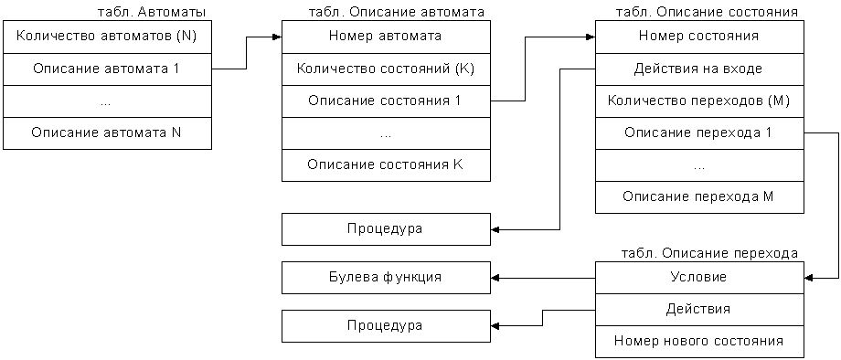
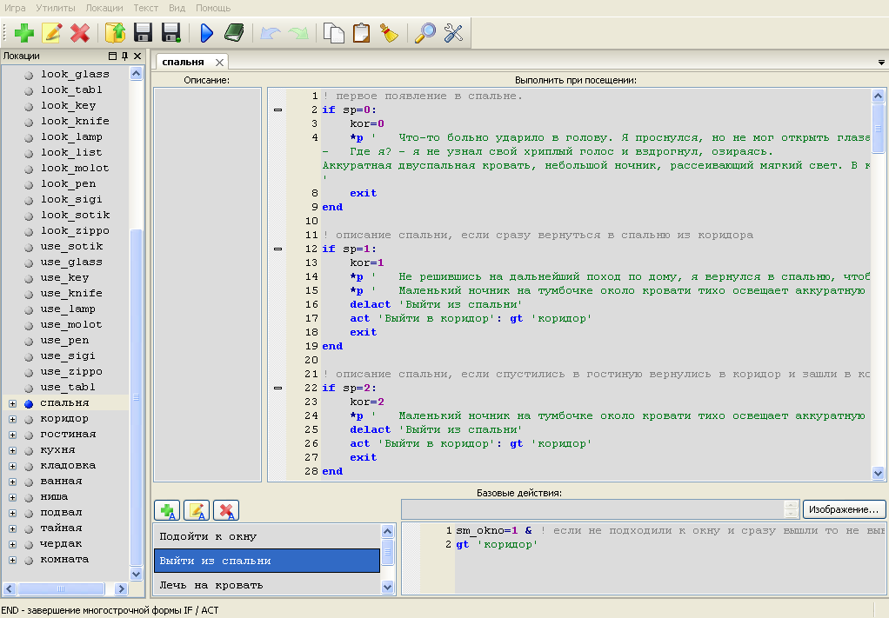
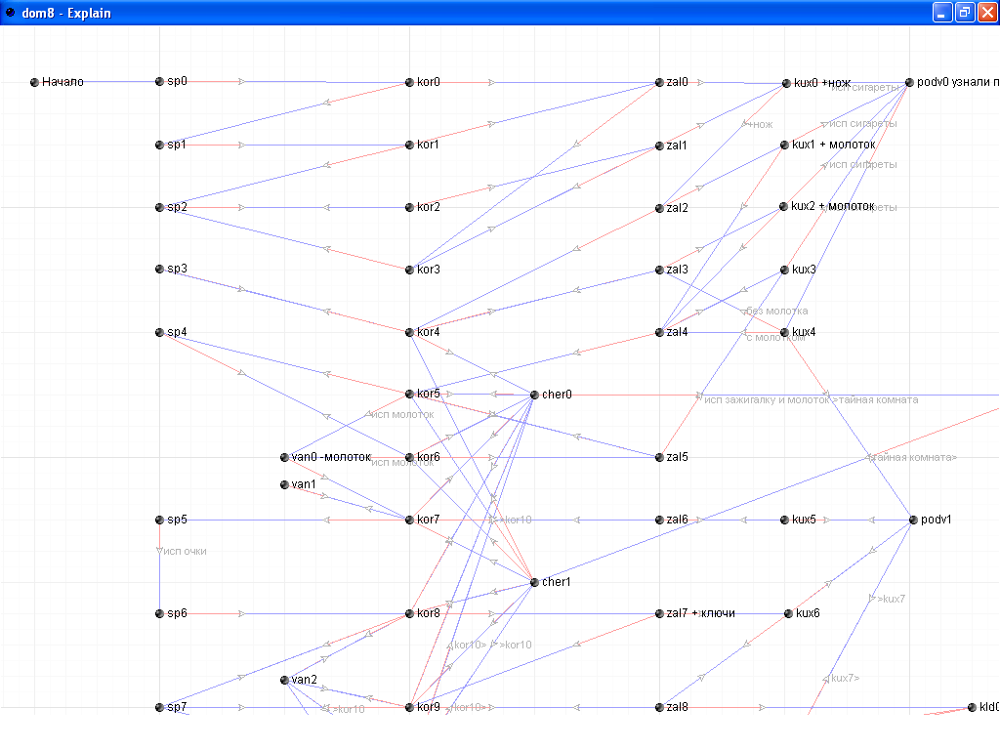

# Автоматное программирование в QSP
<!-- [:informarch_automateprogs] -->

Всем привет,

В этой статье хочу рассказать о новом подходе, структурировать программный код при написании игр на QSP.  Казалось бы, в QSP и так присутствует вполне логическая структура локации: описание локации, действия на локации, пользовательский код при посещении локации. Но так бывает, что для одной локации нужно выводить несколько различных описаний локации, тем более, если эта локация посещается не раз и в ней, по сюжету, происходят новые действия, появляются персонажи или меняются условия.

Какие могут быть варианты решения?

| Вариант 1                                                                                                                                                                                                                                                                                                            | Вариант 2                                                                                                                                                                                                                                                                                      |
| -------------------------------------------------------------------------------------------------------------------------------------------------------------------------------------------------------------------------------------------------------------------------------------------------------------------- | ---------------------------------------------------------------------------------------------------------------------------------------------------------------------------------------------------------------------------------------------------------------------------------------------- |
| В редакторе QSP нет ограничений по числу локаций, поэтому можно создать несколько вариантов одной и той же локаций на каждый новый случай. Получится список «комната1», «комната2», «комната3» и т.д. В каждой локации можно добавить уникальное действие, нового персонажа  или определенные условие при посещении. | В одной локации «комната» в условии при посещении писать программный код учитывающий все возможные варианты которые могут происходить в локации. За частую, появляется много условий, и логическая составляющая кода усложняется на столько, что найти ошибку становиться очень проблематично. |


У вас есть свое решение? Обязательно поделитесь. 😊

Рассмотрим плюсы и минусы этих вариантов.

## Вариант 1

+ Каждая локации подчиняется изначальной структуре заложенной в QSP. Описание локации в своем окне, действия в своем и код при посещении на месте.
+ Простота кода при посещении, только тот код который в данный момент нужен на локации, нет нагромождения условий.
- Увеличение числа локаций в дереве игры затрудняет ориентирование в редакторе.
- В каждой локации присутствуют однотипный (общий) код при посещении, действия на локации, что увеличивает размер игры. А также потребность исправления во всех локация однотипных участков, если вдруг потребуется их изменить или что-то добавить.
- В каждой локации будут уникальные переходы в действиях на смежные локации, которые также имеют свои «версии локации», что затрудняет навигацию по переходам между локациями. Т.е. в локации «комната1» будет действие «Выйти из комнаты»: goto «коридор1»  в локации «комната2» будет действие «Выйти из комнаты»: goto «коридор2» или может быть другой вариант и т.д. Таким образом, появляются ошибки: переходы могут либо совпасть, либо действие перехода никуда не ведет, либо отсутствует необходимое действие перехода совсем.

### Резюме по варианту 1

Неплохой подход при написании игры, но требует предварительной работы по разбивки всего сюжета на локации и в свою очередь действий внутри локации на серию локаций. А также необходимость в четком дереве (графе) переходов между локациями. Не наглядное представление, куда можно перейти из локации.

## Вариант 2

+ Число локаций соответствует задумке автора, и если комната одна в доме, то и локация «комната» одна.
+ Весь код на локации со всеми действиями, условиями и персонажами в одном месте.
+ Возможность «программировать на лету». Т.е. по мере появления потребности в переменных, условиях, персонажах и т.п. вставляется новый код или модифицируется код написанный.
+ Вытекает из предыдущего плюса - широкое поле творчества, так как буквально все находиться в окне выполнение при посещении и тут полет фантазии ограничен только самой фантазией.
- Нагромождение кода в одном месте.
- И вытекающее из предыдущих плюсов и минусов, разобраться в коде, с каждым новым добавлением, становиться все сложнее, а вернуться к написанию игры через продолжительный перерыв - невозможно.

### Резюме по варианту 2

Такой подход к написанию игр выбирается в большинстве случаев из-за «программирования на лету», годится лишь для написания небольших игр и за один подход, иначе игра просто остается недописанной.

## Что же делать?

На просторах интернета я нашел интересный метод программирования, который как нельзя лучше подходит под наши нужды, красивого писания игр на QSP. Этот метод объединяет лучшие качества рассмотренных выше двух вариантов. Заключается он в дополнительной структуре программного кода, в результате чего программа выглядит сложенной из кирпичиков, однотипных блоков кода.

На рисунке изображено схематически что из чего следует.



Проведем аналогии с QSP терминологией:

**Табл. Автоматы** – Перечень наших локаций то что мы видим в левой части QSP редактора.

**Табл. Описание автомата** – Описание на локации обратите внимание, описание зависит от состояния, т.е. у одной локации может быть несколько описаний локации.

**Табл. Описание состояния** – Состояния локации, где могу быть свой код при посещении см Процедура, Обратите внимание, переходы (переходы между состояниями или локациями или ещё точнее между стояниями локаций) в каждом состоянии индивидуальны.

**Табл. Описаний переходов** – Наши действия с переходом goto «новая локация». Здесь могут быть условия перехода на картинке изображено блоком Булева функция, а так же номер нового состояние локации куда мы перейдем по выбора этого действия.

Пока выглядит немного запутано, но рассмотрим программный код, написанный по этому методу на примере игры «Дом пустоты».



В левой части мы видим перечень локаций. Каждая локация это наш автомат, который может иметь несколько состояний.

В окне выполнить при посещении мы видим некие блоки которые начинаются комментарием, затем идет `IF`, далее тело блока, и заканчивается `END`.

Так как локация спальня у нас одна, по сюжету ГГ может посещать её несколько раз, то в окне «Выполнить при посещении» пишем шаблон:

1. Комментарий описывающий состояние автомата – для себя чтобы быстро найти нужное состояние локации.
2. Условие входа в локацию, здесь переменная sp будет отражать состояния локации спальня. Значение `sp = 0` первое появление ГГ в спальне, значение `=1` – ГГ вышел из спальни и сразу же вернулся, обратите внимание описание с первым посещением спальни поменялось.
3. Описание локации в нужном состоянии локации
4. Действия на входе в состояние локации, это может быть переопределение переменных, или другие функции которые должны выполниться при посещении, я для удобства разделили переопределение переменных и вынес их в верх тела шаблона над описанием локаций, а все функции идут ниже описания, но это не принципиально.
5. Переходы из локации. Здесь можно писать уникальные переходы или переходы появляющиеся по условию, а также если в локации есть стандартный набор действий то его можно вынести в соответствующее место и этот набор действий будет общим для всех состояний локации.

Для удобства и наглядности может потребоваться ( и я настоятельно рекомендую применять) графическое представление.

На листке бумаги нужно нарисовать граф нашей игры. Где узлы обозначим их точками или кружочками будут означать состояния локации, а линии со стрелками между узлами будут означать переходы между состояниями локаций. В интернете полно программ позволяющих упростить рисование таких графов,  одна из подобных программ которой пользуюсь я Explain. Программка очень маленькая 1Мб, с минимальным, но вполне достаточным набором инструментов для наших целей.

Вот такой получился у меня граф для игры «Дом пустоты», (это только часть)



Хочу дать несколько советов.

1. Посмотрите на мой пример, все состояния одной локации идут в столбик. Для локация «спальня» sp0, sp1,sp2 …, для локации «коридор» kor0, kor1, kor2 и.т.д. При таком расположении узлов можно сразу найти нужную локацию и все её состояния. Здесь sp0, sp1 это наше состояние  в коде можно увидеть if sp=0… if sp=1.
2. У переходов есть направление, обозначается стрелочкой, если переход возможен обратно в исходное состояние, то нужно соединить 2 узла 2 раза сначала в одну сторону, а потом в другую.
	Переходы лучше писать в теле шаблона сразу после условия входа в состояние:
	```qsp
	IF sp=0: & ! - текущее состояние локации спальня
		 kor=0 & ! - переменная отвечающая за состояние локации коридор
		 *p " ………"
		  ! …
		Exit
	end
	```
	А ниже в списке действий на локации всегда есть возможность выйти в коридор безусловным переходом `gt «коридор»`.
	В локации коридор мы попадает сразу в блок- состояния коридора со значением `0`
	```qsp
	IF kor=0: & ! - текущее состояние локации коридор
		sp=1 & ! - переменная отвечающая за состояние локации спальня
		zal=0 & ! - состояние локации зал
		*p " ………"
		!	 …
		Exit
	end
	```
3. Если в локации ГГ находит предмет или при переходе предмет теряется то удобно обозначать в тексте узла или перехода «+ Имя предмета» предмет добавлен в инвентарь  или «– Имя предмета» предмет удален из инвентаря. А также при использовании предмета «исп. Имя предмета»

Графом может пользоваться и сценарист без знания принципов программирования, так как будет наглядно видеть все цепочки сюжета, и не запутаться откуда и куда ГГ должен попасть в данный конкретный момент.

Какие ещё выгоды при таком системном подходе можно получить, например можно не особо сложно локализовать игру на другие языки.

Если весь текст  вынесен за пределы шаблона в отдельную локацию, по одной локации для каждого языка.

- URL на программу Explain http://www.bestfree.ru/soft/graph/mindmap.php
- Загрузить Explain с моей странички http://day0.narod.ru/stat/Explain.zip
- URL картинки схема http://day0.narod.ru/stat/shema.PNG
- URL картинки редактор   http://day0.narod.ru/stat/red.PNG
- URL картинки граф  http://day0.narod.ru/stat/graf.PNG
- URL граф игры "Дом пустоты" для программы Explain  http://day0.narod.ru/stat/dom8.txt
- URL игры "Дом пустоты" http://day0.narod.ru/stat/b26.qsp

Автор: **HIMAN**
11.09.2011 21:06
