# Учебник по QSP для редактора QGen
<!-- [:informarch_qgen_teach] -->

Перед вами - учебник для написания игр в программе QGen.

Он создан для авторов, не имеющих опыта в программировании.

Последовательно и внимательно выполнив все задания из учебника, вы освоите QSP настолько, чтобы самостоятельно создавать свои игры. Благодаря подробным инструкциям и скриншотам, а также простоте языка QSP, это будет несложно.

Этот учебник будет вам полезен только в том случае, если вы будете на самом деле выполнять описанные в нем задания. Простое "чтение" уроков, а также "выполнение в уме" сведет эффект учебника к нулю. Выполнять уроки следует только в той последовательности, в которой они написаны, не пропуская ни одного.

Для того, чтобы приступить к выполнению заданий, убедитесь, что вы

* Установили [плеер QSP](https://qsp.org/index.php?option=com_content&view=article&id=64&Itemid=56)
* Скачали и распаковали [редактор QGen](https://qsp.org/index.php?option=com_content&task=view&id=46&Itemid=56)
* Скачали справку по QSP со страницы ["Разработчикам"](https://qsp.org/index.php?option=com_content&view=article&id=57&Itemid=56)

Всё есть? Смело приступаем к первому уроку!

## Урок первый. Создаём игру.

Запускаем QGen. Выбираем меню "Утилиты\Настройки".

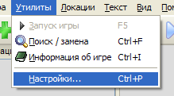

Открываем вкладку "Пути".

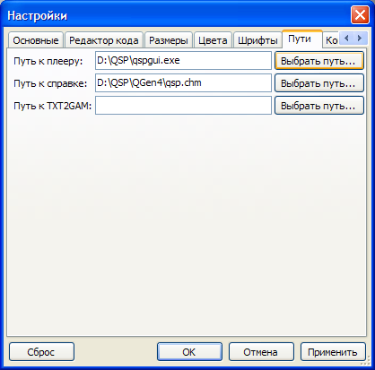

Указываем "Путь к плееру" и "Путь к справке". Нажимаем "ОК".

Игровые локации - это небольшие части, на которые мы делим игру.

Создаём локацию. Нажимаем зелёный крестик.


В появившемся окне пишем название локации - в нашем уроке она будет называться "Начало".

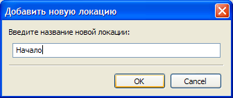

Нажимаем "ОК".

В поле описания локации(курсор находится в нём по умолчанию) пишем

```
Привет, мир!
```

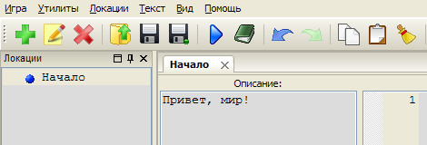

Выбираем "Игра\Сохранить".

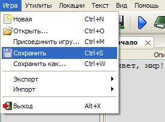

Пишем имя для файла, в котором будет храниться игра - "учебная".

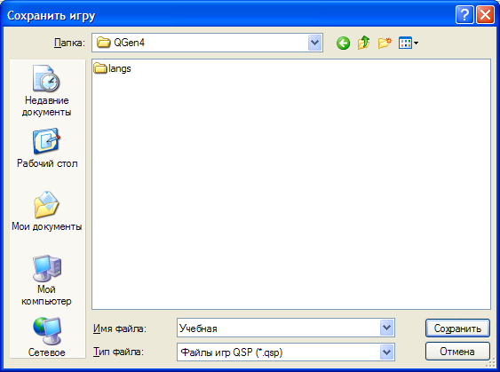

Нажимаем "Сохранить".

Появится окошко для ввода пароля.

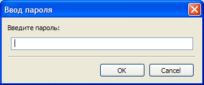

Ничего вводить не нужно, нажимаем "OK".

Запускаем игру, для этого нажимаем синий треугольник.

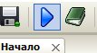

Запустится плеер QSP с нашей игрой.

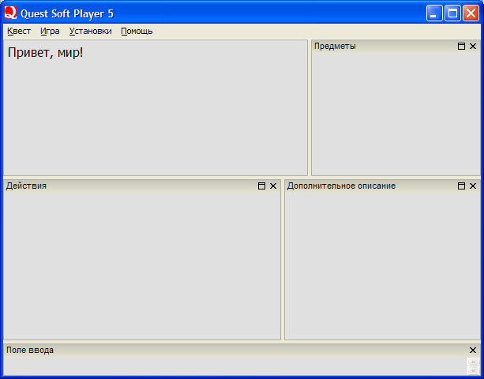

Закрываем окно плеера. В поле "Выполнить при посещении" пишем

```qsp
showstat 0
showinput 0
```

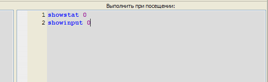

- "`SHOWSTAT 0`" означает, что мы отключаем "окно дополнительных описаний",
- "`SHOWINPUT 0`" - отключаем "поле ввода". В наших уроках они использоваться не будут, и поэтому для нашей игры их стоит отключить.

Запускаем. Смотрим, что изменилось:

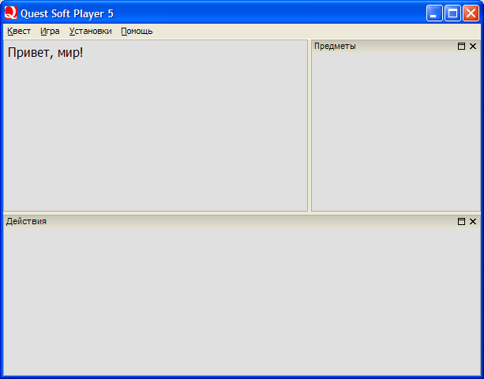

Итог: в этом уроке мы научились делать начальную настройку QGen, сохранять игру, создавать игровые локации, показывать текст в поле описания, отключать неиспользуемые окна и запускать игру прямо из QGen.

## Урок второй. Переходы по локациям.

В описании локации "Начало" удаляем строку "Привет, мир!" и пишем

```
Новое приключение героя.
```

Создаём локации "Об игре", "Об авторе".
В описании локации "Об игре" пишем

```
Перед вами величайшая игра всех времён. И народов. Точно.
```

В описании локации "Об авторе" пишем

```
Автор сей замечательной игры - великолепен и неподражаем. Вы сами сможете убедиться в этом, поиграв в мою игру.
```

У нас есть три локации, осталось связать их вместе, сделать переходы между локациями. Для этого нам нужно добавить "действия" для каждой локации.

Выбираем в списке слева локацию "Начало" двойным щелчком мыши.

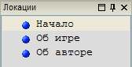

Откроется вкладка с заголовком "Начало".

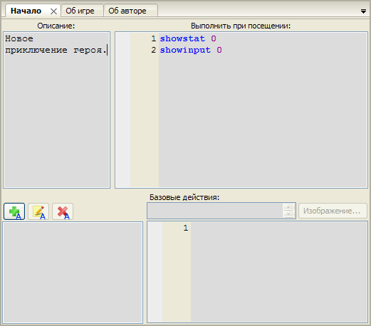

В нижней части окна есть кнопка "Добавить действие", нажимаем её.


В появившемся диалоговом окне вводим название действия - "Об игре".

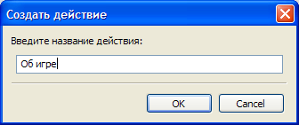

В поле для ввода текста, находящемся правее и ниже названия действия, пишем

```qsp
GOTO 'Об игре'
```

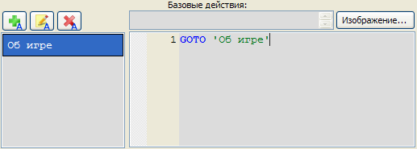

С помощью оператора GOTO мы указываем, на какую локацию будет осуществляться переход.

Таким образом, мы создали переход с локации "Начало" на локацию "Об игре".

Добавим ещё одно действие на локации "Начало". Нажимаем `Alt+F7`, вводим имя действия - "Об авторе". Задаём команду перехода, пишем

```qsp
GOTO 'Об авторе'
```

1. Выбираем локацию "Об игре".
2. Создаём действие "Вернуться", в нём указываем переход на локацию "Начало".
3. Выбираем локацию "Об авторе".
4. Аналогично, создаём действие "Вернуться" - переход на локацию "Начало".


Теперь у нас есть три локации, связанные переходами.

Запускаем игру, смотрим, что получилось.

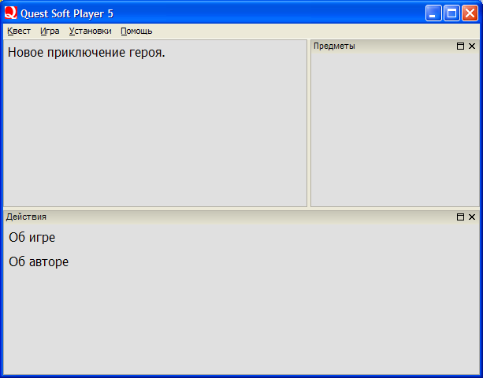

Нажимая действия, мы сможем свободно перемещаться между локациями.

Итог: в этом уроке мы научились создавать действия, осуществлять переходы по локациям.

## Урок третий. Простейшая игра с выбором

Создаём локацию "Развилка". В описании пишем:

```
Вышел герой к реке, куда дальше идти?
```

Создаём локацию "Выиграл". В описании пишем:

```
Переплыл герой реку и завершил своё приключение с победой.
```

Создаём локацию "Проиграл". В описании пишем:

```
Брёл герой вдоль берега, брёл. А потом его съел медведь. Так наш герой проиграл.
```

Мы создали три игровые локации, теперь сделаем переходы между ними.

В локации "Начало" создаём действие "Играть" с переходом в локацию "Развилка".

В локации "Развилка" создаём три действия: "Переплыть реку" с переходом в локацию "Выиграл"; "Налево вдоль реки" и "Направо вдоль реки" с переходом в локацию "Проиграл".

В локации "Проиграл" создаём действие "Начать сначала" с переходом на локацию "Начало".

Запускаем. Первая игра готова!

Итог: в этом уроке мы научились создавать в игре выбор, от которого зависит развитие сюжета.

## Урок четвертый. Переменные.

Переменные - это "память" игры.

В переменных хранится информация обо всем, что изменяется в процессе игры. Автор называет переменные так, как ему удобно, главное следить за тем, чтобы в имени переменной не было других знаков, кроме букв, цифр и символов подчеркивания. Пробелы в имени не допускаются, для разделения пользуйтесь подчеркиванием, вот так: `моя_первая_переменная`. Если в начале имени стоит знак "$", значит, в переменной хранится текст, если нет, то в ней хранится число.

Основные действия с переменными, это запись, чтение и вывод.

### Запись

Когда мы говорим плееру, "в переменной a будет храниться значение 5" - это запись в переменную. Также запись назвают "присваиванием", это одно и то же.

В коде это выглядит так:

```qsp
a = 5
```

Мы записали в переменную "a" числовое значение 5. Знак "=" здесь не обозначает равенство, как в математике, он обозначает операцию присваивания. Переменная, в которую мы записываем значение, должна всегда стоять слева от знака "=".

Как же записать в переменную не число, а текстовую строку? Очень просто. Во-первых, не забываем ставить знак "$" в начале имени переменной. Во-вторых, заключаем строку в апострофы.

```qsp
$строка = 'Быть или не быть?'
```

Мы записали в переменную "$строка" текстовое значение "Быть или не быть?"

### Чтение

Чаще всего, значение переменной нам требуется для нового присваивания, либо для проверки условия.

Вот, например, мы прибавляем 10 к переменной "a", и записываем результат в переменную "k".

```qsp
k = a + 10
```

Допустим, в переменной "a" было записано 5. Тогда k = 5 + 10 = 15. В переменной "k" теперь хранится значение 15. Обратите внимание, в этой строке кода было произведено чтение значения переменной "a", вычисление выражения "a + 10", и запись результата в переменную "k".

Уменьшаем значение переменной "k" на 2.

```qsp
k = k - 2
```

В переменной "k" было записано 15. Значит, k = 15 - 2 = 13. Теперь в переменной "k" хранится значение 13.


Для текстовых переменных существует операция "склеивания строк", записывается она знаком "+".

```qsp
$вопрос = $строка + ' Вот в чем вопрос.'
```

Теперь в переменной "$вопрос" хранится текстовое значение "Быть или не быть? Вот в чем вопрос."

Использование переменных в условиях мы разберем в следующем уроке.

### Вывод

Для вывода используйте двойные угловые скобки, "`<<`" и "`>>`". Между двойными угловыми скобками напишите имя переменной, например "`<<$вопрос>>`", или "`<>`", и при выводе плеер сам подставит текущее значение переменной, при этом угловые скобки выведены на экран не будут.

### Применяем знания

Начнем применять переменные на практике. Создайте новую игру, назовите ее "Planet Master".

**Локация "Начало"**

Создайте локацию "Начало", в описании напишите "Создайте свою планету и сможете управлять ей в меру своих скромных возможностей."

В коде локации(поле "выполнить при посещении") отключите неиспользуемые окна. На этот раз окно инвентаря нам не понадобится, поэтому его тоже отключаем.

```qsp
SHOWSTAT 0
SHOWINPUT 0
SHOWOBJS 0
```

Создайте действие "Создать планету" с переходом на локацию "СоздатьПланету".

**Локация "СоздатьПланету"**

Создайте локацию "СоздатьПланету". В коде локации пишем

```qsp
$Имя = $INPUT('Придумайте имя для своей планеты.')
Температура = 100
'Ваша планета называется <<$Имя>>.'
```

Рассмотрим подробно.

В первой строке, мы просим игрока ввести имя для планеты. В скобках функции INPUT указано приглашение, которое прочтет игрок. Текст, который введет игрок, будет сохранен в текстовой переменной $Имя.

Вторая строка задает значение для числовой переменной Температура. В этой переменной будет храниться текущая температура для планеты.

В третьей строке на экран описания локации выводится текст. В выводимом тексте, вместо выражения `<<$Имя>>` плеер подставит значение переменной `$Имя`, то есть тот текст, который ввел игрок. Если игрок ввел "Персефона", то на экране будет написано "Ваша планета называется Персефона."

Создайте действие "Управлять планетой" с переходом на локацию "Планета".

**Локация "Планета"**

Создайте локацию "Планета". В описании локации пишем

```
Имя планеты: <<$Имя>>
Температура на планете: <<Температура>> градусов.
```

При выводе на экран, вместо `<<$Имя>>` и `<<Температура>>` будут подставлены значения указанных переменных.

Нам нужно, чтобы игрок мог изменить температуру на планете. Для этого сделаем несколько действий, в которых будет меняться переменная Температура.

Создайте действие "Поднять температуру на 10 градусов".

В коде действия пишем

```qsp
Температура = Температура + 10
GOTO $CURLOC
```

В первой строке, мы увеличиваем на 10 единиц значение переменной Температура. Если температура планеты была 100 градусов, то при выборе этого действия температура планеты станет 110 градусов, и так далее.

Вторая строка задает переход на текущую локацию. `$CURLOC` - специальная функция, которая всегда возвращает имя текущей локации, в нашем случае это локация "Планета".

Зачем же нам "переходить" на локацию, на которой мы и так уже находимся? Это нужно для того, чтобы обновить текст описания локации. Переменная Температура была изменена, но изменения в описании появятся только при "входе" на локацию, поэтому мы должны явно задать переход.

Создайте аналогичное действие "Снизить температуру на 10 градусов".

Создайте действие "Установить комнатную температуру". Код действия:

```qsp
Температура = 25
GOTO $CURLOC
```

При выборе этого действия, температура планеты станет 25 градусов, вне зависимости от того, какой она была. Обычное присваивание.

Создайте действие "Создать новую планету" с переходом на локацию "СоздатьПланету". Когда игроку надоест одна планета, он может выбрать это действие и создать новую.


Игра готова!

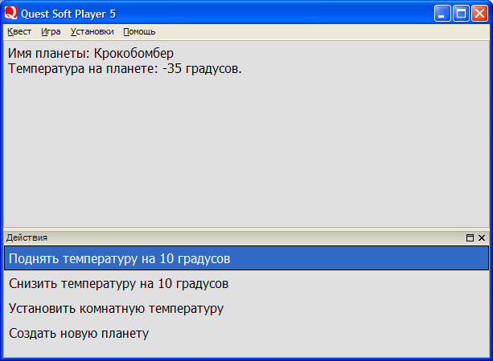

Итог: в этом уроке мы узнали, что такое переменная, как вывести значение переменной на экран, какие операции возможны с переменными.

## Урок пятый. Условия

Условия - самый важный и мощный инструмент в разработке текстовой игры. Автору требуется не только вести учет состояния игры(переменные), но и делать прохождение игры зависящим от изменившегося состояния. Для этих целей в QSP есть условный оператор - "IF".

Записывается так:

```qsp
IF условие :
    действие1
ELSE
    действие2
END
```

Если `условие` выполняется, то будет выполнено `действие1`, если нет - `действие2`.

Когда нам требуется задать только `действие1`, запись будет короче:

```qsp
IF условие :
    действие1
END
```

Напишем игру, в которой прохождение будет зависеть от того, побывал ли игрок на некоторой локации.

**Локация "Начало"**

Создайте локацию "Начало", в описании напишите "Игра про космос."

В коде локации отключите неиспользуемые окна. Окно инвентаря в этой игре не понадобится, поэтому его тоже отключаем. Для удобного перезапуска игры из локации проигрыша, добавим оператор KILLALL, он очищает все переменные и инвентарь. Теперь достаточно сделать переход на локацию "Начало", чтобы состояние игры было "сброшено".

```qsp
KILLALL
SHOWINPUT 0
SHOWSTAT 0
SHOWOBJS 0
```

Создайте действие "Играть" с переходом на локацию "Играть".

**Локация "Играть"**

Создайте локацию "Играть". В описании пишем: "Вы долго исследовали пояс астероидов и настала пора возвращаться на Землю."

Создайте действие "Связаться с диспетчером" с переходом на локацию "Диспетчер".

Создайте действие "Лететь на Землю". В коде действия пишем условие:

```qsp
IF Курс_Полёта = 1:
  GOTO 'Победа'
ELSE
  GOTO 'Проигрыш'
END
```

Рассмотрим подробно.

Мы проверяем значение переменной `Курс_Полёта`. Условие "Курс_Полёта = 1" означает "Значение переменной Курс_Полёта должно равняться 1". Если значение равняется `1`, то при нажатии этого действия будет переход на локацию "Победа", иначе - переход на локацию "Проигрыш".


**Локация "Диспетчер"**

Создайте локацию "Диспетчер". В описании пишем

```
 - Вызываю диспетчера, вызываю диспетчера.
 - Диспетчер на связи, высылаю вам курс полёта через пояс астероидов до Земли.
 - Курс полёта принял.
```

В коде локации пишем

```qsp
Курс_Полёта = 1
```

Здесь мы "запоминаем", что игрок зашел в локацию, записав в переменную Курс_Полёта значение 1. Если игрок не заходил в локацию, то значение переменной будет 0.

Создайте действие "Завершить сеанс связи" с переходом на локацию "Играть".

**Локация "Победа"**

Создайте локацию "Победа". В описании локации пишем: "Вы благополучно долетели до Земли. Хорошо, что вы связались с диспетчером и получили у него курс полёта."

**Локация "Проигрыш"**

Создайте локацию "Проигрыш". В описании пишем: "Лететь без курса полёта через пояс астероидов - чистой воды самоубийство. Вам не повезло и один из астероидов протаранил ваш корабль, так что на Земле вас так и не дождались."

Создайте действие "Начать сначала" с переходом на локацию "Начало".

Игра готова!

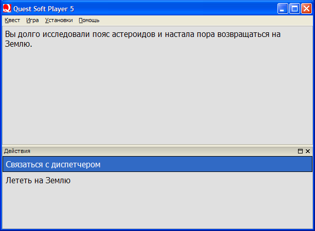

Итог: в этом уроке мы научились использовать условия.

## Урок шестой. Берём предметы

В текстовых играх часто применяются предметы. Для того, чтобы игрок всегда знал, какие предметы у него с собой, в QSP есть специальное окно инвентаря(с заголовком "Предметы"). Когда игрок берет предмет, тот появляется в инвентаре.

Для того, чтобы добавить предмет в инвентарь, используется оператор `ADDOBJ`, для того, чтобы удалить предмет из инвентаря, используется оператор `DELOBJ`.

Записывается так:

```qsp
ADDOBJ 'Название предмета'
DELOBJ 'Название предмета'
```

Есть три основных способа брать предмет, рассмотрим каждый на примере.

Создайте локацию "Начало", с описанием "Игра про гномов." и действием с переходом на локацию "Играть". Отключите неиспользуемые окна - дополнительное описание и строку ввода.

Создайте локацию "Играть". В описании напишите:

```
Вы спасли гномьего короля от смерти в лапах тигра.
 - Бери алмазов сколько захочешь, бери рубинов, сколько унесёшь, бери Меч Справедливости, он у нас один.
```

Берем предметы без ограничений.

Напишем действие для того, чтобы брать алмазы. Создайте действие "Взять алмаз". В коде действия пишем:

```qsp
ADDOBJ 'Алмаз'
```

Действие готово. Теперь, когда игрок выберет это действие, в инвентаре добавится предмет "Алмаз". Сколько раз нажмет, столько алмазов добавится, без ограничений по количеству.

Берем не более 5 предметов.

Напишем действие для того, чтобы брать рубины. По замыслу игры, игроку позволено взять только 5 рубинов. Создайте действие "Взять рубин". В коде действия пишем:

```qsp
IF Количество_Рубинов < 5:
  ADDOBJ 'Рубин'
  Количество_Рубинов = Количество_Рубинов + 1
ELSE
  'Жадность не порок, но вы не можете унести больше, чем уже взяли.'
END
```

В этом действии делается проверка на количество рубинов, которые уже взял игрок. Если количество рубинов меньше 5, то он может взять еще один рубин. Если нет, то выводим строку текста.

Обратите внимание на строку

```qsp
Количество_Рубинов = Количество_Рубинов + 1
```

Здесь переменная "Количество_Рубинов" увеличивается на 1 каждый раз, когда игрок берет рубин. Такую переменную называют "счетчиком". Пока игрок не взял ни одного рубина, в этой переменной будет значение 0. Когда игрок будет брать рубины, это значение будет увеличиваться, пока не достигнет максимального значения 5.

Берем только один предмет.

Напишем действие для того, чтобы взять меч. Это действие будет присутствовать на локации только в том случае, если игрок еще не взял меч. Поэтому мы не создадим действие как обычно, а напишем его в коде самой локации, "обернув" его в условие. Пишем в коде локации:

```qsp
IF Меч = 0:
  ACT 'Взять Меч Справедливости':
    ADDOBJ 'Меч Справедливости'
    Меч = 1
    GOTO $CURLOC
  END
END
```

Переменная "Меч" принимает всего два значения: 0 и 1. Такую переменную назвают "флажком". Изначально в переменной "Меч", как и в любой другой числовой переменной, хранится значение 0. Условие "Меч = 0" выполняется, и действие "Взять Меч Справедливости" добавляется в список действий.

Рассмотрим подробно, что произойдет, когда игрок выберет это действие.

```qsp
ADDOBJ 'Меч Справедливости'
```

В инвентарь добавляется предмет "Меч Справедливости".

```qsp
Меч = 1
```
В переменную "Меч" записывается значение 1. Мы "установили флажок", теперь игра "помнит", что игрок взял меч.

```qsp
GOTO $CURLOC
```

Переход на текущую локацию. Заново выводится описание локации, заполняется список действий, и выполняется код локации. Условие "`Меч = 0`" не выполнится, и поэтому действие "Взять Меч Справедливости" не будет добавлено.

Итог: в этом уроке мы научились брать предметы тремя способами - без ограничений, с ограничением по количеству, и однократно.

## Урок седьмой. Применение предметов

Основной способ сделать "применение" предмета в игре - создать действие, которое будет доступно только при наличии предмета в инвентаре. Рассмотрим на примере.

**Локация "Начало"**

Создайте локацию "Начало", с описанием "Игра про Дверь." и действием с переходом на локацию "Комната". Отключите строку ввода.

**Локация "Комната"**

Создайте локацию "Комната". В описании пишем: "Вы стоите в центре комнаты, заполненной грудами ненужного хлама. У дальней стены вы видите дверь."

Создайте действие "Подойти к двери" с переходом на локацию "Дверь".

Теперь сделаем взятие предмета. Предмет можно взять только один раз, поэтому используем третий способ из предыдущего урока. Пишем в коде локации:

```qsp
IF Ключ = 0:
  'На полу вы видите небольшой ключ.'
  ACT 'Взять ключ':
    Ключ = 1
    ADDOBJ 'Ключ'
    PL 'Вы взяли ключ.'
    GOTO $CURLOC
  END
END
```

Обратите внимание, что строка "На полу вы видите небольшой ключ." находится внутри условия. Благодаря этому, она будет на экране до тех пор, пока игрок не возьмет ключ.

Также обратите внимание на строку

```qsp
PL 'Вы взяли ключ.'
```

PL - оператор вывода текста в окно дополнительного описания. При переходах между локациями дополнительное описание не очищается, поэтому в него удобно записывать результаты совершенных действий.

**Локация "Дверь"**

Создайте локацию "Дверь". В описании пишем: "Дверь заперта."

Создайте действие "Отойти от двери" с переходом на локацию "Комната".

Сделаем применение предмета. Пишем в коде локации:

```qsp
IF OBJ 'Ключ':
  ACT 'Открыть дверь ключом':
    DELOBJ 'Ключ'
    GOTO 'Победа'
  END
END
```

Рассмотрим подробно. Условие "OBJ 'Ключ'" определяет, находится ли предмет "Ключ" в инвентаре. Действие "Открыть дверь ключом" будет доступно тогда, когда предмет "Ключ" находится в инвентаре.

Обратите внимание на строку

```qsp
DELOBJ 'Ключ'
```

После того, как мы открыли дверь, ключ нам больше не нужен, поэтому мы удаляем его из инвентаря.


**Локация "Победа"**

Создайте локацию "Победа" с описанием "Вы выбрались из комнаты."

Игра готова.

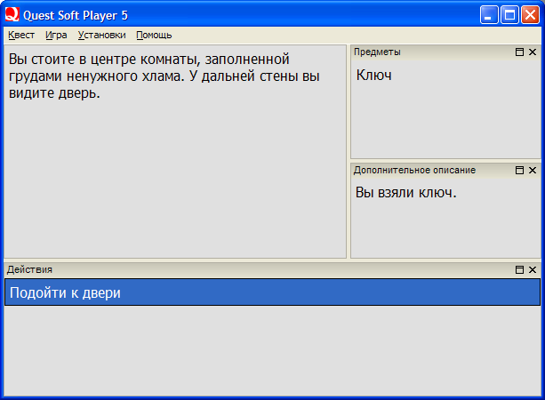

Итог: в этом уроке мы научились применять предметы в игре.

**Теперь вы овладели всеми основными приемами разработки игр на QSP, и уже можете начинать писать свои игры.**

----

Автор: **NEX**
27.02.2009 10:41